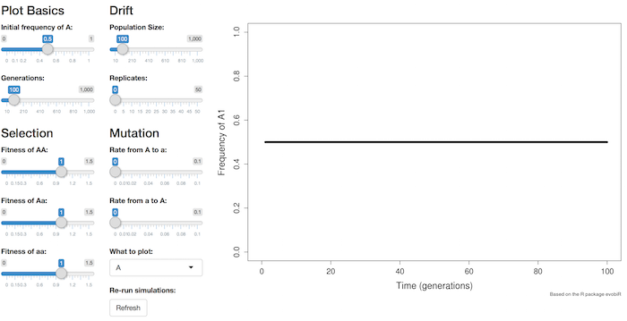

```{r, echo = FALSE}
question.number <- 1

TA.VERSION <- F
TA.TXT <- ifelse(TA.VERSION, "markup", "hide")
TA.FIG <- ifelse(TA.VERSION, "asis", "hide")
```
```{r global_options, include = FALSE}
library("knitr")
opts_chunk$set(comment=NA, fig.width=4, fig.height=4)
```

`r if(TA.VERSION){"#### **TA VERSION (with answers)**"}`

# Introduction

Once an allele enters a population (by mutation or migration), its evolutionary fate is determined by selection and drift.
In this lab, you will use a computer program to explore how the the prevalence of an allele in a population (its frequency) is affected by a variety of factors---its initial frequency, whether it is dominant or recessive, the relative fitnesses of individuals bearing different alleles, and population size.

Throughout this lab, we will focus on a single locus with two alleles, A and a.
We will assume that mating is random with respect to this locus, and that there is no gene flow from other population.

## Evolution Across Generations

The core of a population genetics model is to describe how allele frequencies change over time.
A computer can quickly simulate many generations, rather than doing a ton of calculations by hand.
We will use an R computer program in this lab.
You don't need to worry about the actual code that it contains,however, it is important to understand what goes on inside such a program.

Let's focus on the scenario in which there is selection, but not drift, mutation, or migration.
The basic idea is to start with some initial frequency of allele A, compute how it changes within the first generation, compute how it changes within the second generation, and so on.
Here is what a computer program would do:

  1. Have some initial frequency of allele A.
  2. Compute frequencies of genotypes AA, Aa, and aa, based on the frequency of A in step 1.
  3. Adjust the genotype frequencies based on the relative fitnesses of each genotype.
  4. Compute the frequency of A from the genotype frequencies in step 3.
  5. Return to step 1, but now using the frequency of A determined in step 4.

`r if(TA.VERSION){"**TA Note:** *Please walk the class through these steps in gory detail.  For example, have students provide numbers of initial freq(A), w~11~, w~12~, and w~22~.  Write out the math for each step, having students with calculators plug in the numbers and call out the answers.  Do two full generations at least, so they get the sense of iteration.  Maybe also do the case where all the fitnesses are equal, so they see the allele freq doesn't change.  Maybe plot on the board the values of freq(A) for the few generations, to connect with the plots they'll be seeing during the rest of the lab.*"}`

`r if(TA.VERSION){"**TA Note:** *It might also be good to remind the class how to convert between [w~11~, w~12~, w~22~] (used in the app for this lab) and [1, 1-hs, 1-s] (used in lecture).  First divide by w~11~, then use w~22~ to get s, then use w~12~ and s to get h.*"}`

## Lauching the Population Genetics Application

The population genetics application you will be using is a computer program written in R.
This week, though, you won't be working with any R code once you get the application launched.
There is an R package called [shiny](http://shiny.rstudio.com/) that makes it easy to write programs with graphical user interfaces.
So, you'll have sliders to drag rather than lines of code to execute.
(The Shiny application we'll be using is in the package [simpopgen](XXXXX)

If you are working on your own computer, you'll need to install shiny, devtools, and simpopgen: `install.packages("shiny")`.
The lab computers already have shiny installed.

Our program consists of two files, which you will need to obtain and provide for R.

  1. [Download this zip file of the population genetics R program](popgen_app.zip)
  2. You should now have `popgen_app.zip` on your Desktop or in your Downloads folder.  Find it.
  3. Unzip the `popgen_app.zip` file.  Different computers do this differently---ask your TA if you need help.
  4. You should now have a *folder* called `popgen_app`.  Put it on your Desktop.  (Or if you put it somewhere else, you'll need to adjust the `setwd()` command below.)
  5. Open this folder to double-check that it contains the two files we need: `server.R` and `ui.R`.  *Do not edit the code in these files, and do not try to run the code in the normal way.*  But if you're interested to see the code we'll be using, this is it.
  6. Start R or RStudio.

In your R window, type (or copy-paste) the following commands:

```{r, eval = FALSE}
# Set your working directory, so R knows where to look for the application you obtained above.
setwd("~/Desktop")

# Load the library called "shiny".
library(shiny)

# Launch the population genetics application.
runApp("popgen_app")
```

You should now see a new window that looks like the screenshot below.
At this point, you can minimize your R/RStudio window (you won't be typing anything else into it), but don't quit R.



To be sure the application is responsive, drag the slider that changes the initial frequency of allele A.
It's in the upper-left.
You should see the line plotted on the right change position.

For each topic below, the goal is for you to develop a sense of how the various parameters affect the frequency of allele A.
Each topic begins with some suggested scenarios to investigate, but you are encouraged to experiment further.
Each topic concludes with a question for you to answer and turn in with your lab report.

# Selection

The default settings are that all three genotypes have the same fitness.
You can see the relative fitness values on the sliders in the "Selection" section of the application.
So you have already obtained the first population genetics result in this lab: when fitness does not depend on genotype, allele frequency remains constant over time, regardless of what its initial value is.

In this first set of explorations, you will be adjusting the fitnesses of the three genotypes to learn how that affects the allele frequencies over time.

Note: The fitness of the AA genotype will sometimes be called w~11~.
Similarly, w~12~ is the fitness of the heterozygote, and w~22~ is the fitness of the other homozygote.

## Directional selection

Here are some scenarios to explore, to get a sense for how directional selection alone affects allele frequencies.

1. Keeping w~11~ = w~12~ = 1, reduce w~22~.  (Which allele is dominant now?)  See how this affects the eventual (equilibrium) allele frequency, and how fast that equilibrium is reached.  You may need to increase the number of generations plotted.

2. Keeping w~12~ = w~22~ = 1, increase w~11~.  (Which allele is dominant now?)

3. Compare the results from the previous two scenarios, starting with a very small initial frequency of A (like 0.01).  To make this comparison "fair" (i.e., focused only on dominance), be sure that you either decrease w~22~ or increase w~11~ by the same amount.

4. While you are exploring #3, switch the plot to show the frequency of Aa over time.  With strong enough selection, you should see it increase, peak, and then decrease.  (Why?)

5. Set selection to any values that favor A.  Adjust the initial frequency of A through the entire possible range, from 0 to 1.  Observe the equilibrium frequency of A that is reached.

6. Switch between plotting A and a.  Note that always, freq(A) + freq(a) = 1, so as one goes up, the other goes down symmetrically.

You should be able to understand intuitively why directional selection causes either allele A or a to fix (depending on the fitness values chosen).
(Discuss with your lab partner or TA if necessary.)

When you feel you understand the above explorations, answer the following question.

> ### Question `r question.number` `r question.number <- question.number + 1`
>
(a) When allele A is deleterious and rare, is it eliminated by selection more quickly when it is dominant or when it is recessive?
Explain your intuition, with particular reference to the frequency and fitness of heterozygotes.
>
(b) Show numerical examples that support your conclusion.
Each example (one for A dominant, one for A recessive) should include the three fitness values you chose and the corresponding plot of freq(A).

## Overdominance

Here are some scenarios to explore, to get a sense for how overdominance (also called balancing selection) affects allele frequencies.

1. Set the fitnesses so the heterozygote has highest fitness.  Adjust the initial frequency of A through the entire possible range.  Observe the equilibrium frequency of A that is reached.

2.  Set w~11~ = w~22~ = 1, and w~12~ > 1.  Now increase w~12~ further.  What happens to the equilibrium frequency of A?

3. Set w~11~ = w~22~ = 1, and w~12~ to some value greater than 1.  Now decrease w~22~.  What happens to the equilibrium frequency of A?

You should be able to understand intuitively why overdominant selection causes both alleles to be maintained indefinitely.
(Discuss with your lab partner or TA if necessary.)

When you feel you understand the above explorations, answer the following question.

> ### Question `r question.number` `r question.number <- question.number + 1`
>
Set w~11~ = 1 and w~22~ = 0.85.
>
(a) What value of w~12~ yields an equilibrium frequency for allele A of approximately 0.7?
(The slider does not allow ultra-precise adjustment, so just find the value that seems closest.)
>
(b) Show two plots of your results to illustrate how the same equilibrium frequency of approximately 0.7 is reached from very-different initial frequencies.
>
(c) What is the precise equilibrium value for these three fitnesses?
Use the formula we discussed in class (consulting our [population genetics cheatsheet](popgen_cheatsheet.pdf) if necessary).
Show your work.

## Underdominance

Here is the main scenario to explore, to get a sense for how underdominance (also called disruptive selection) affects allele frequencies.

1. Set the fitnesses so the heterozygote has lowest fitness.  Adjust the initial frequency of A through the entire possible range.  Observe the equilibrium frequency that is reached.  (How does this result differ qualitatively from what you saw for overdominance?)

You should be able to understand intuitively why underdominant selection causes either allele A or a to fix, depending on the initial value.
(Discuss with your lab partner or TA if necessary.)

When you feel you understand the above exploration, answer the following question.

> ### Question `r question.number` `r question.number <- question.number + 1`
>
Set w~11~ = 1, w~12~ = 0.7, and w~22~ = 0.9.
>
(a) Continuously adjust the initial frequency of A until you find the value at which its equilibrium frequency jumps from 0 to 1.
This is the unstable equilibrium allele frequency.
Approximately what is this frequency?
(As best as you can tell given the resolution of the slider.)
>
(b) For these values of fitness, compute the precise equilibrium frequency of A (again consulting our [population genetics cheatsheet](popgen_cheatsheet.pdf) if necessary).
Show your work.

# Genetic Drift

All our investigations so far have assumed there are an infinite number of individuals in the population
This is a reasonable approximation for populations of large size.
When there are few individuals, however, exactly which alleles happen to get passed from one generation to the next can play a big role.
Evolution by this kind of random sampling is called genetic drift.

## Drift Alone

Here are some scenarios to explore, to get a sense for how drift alone affects allele frequencies.

Set all three fitnesses to the same value, so that selection is not influencing the results.
The expected outcome is the horizontal black line: no change in allele frequency.

1. Increase the "Replicates" slider from 0 (the default) to 10.  Each of the new colored lines is the trajectory for a single simulated population.  They all start at the same value in generation 0, but then they diverge and wander.  Click the "Refresh" button a few times to get a sense of the range of variation.

2. Change the population size.  What happens to the range of variation?  What happens to the number of populations in which A is fixed, or is lost?  What happens to the speed with which fixation or loss occurs?

3. Set the initial frequency of A to 0.5.  Across all the timesteps and all the populations, is the allele frequency more likely to go up, down, or neither?  Is it more likely to fix at freq(A) = 1 or freq(A) = 0?

4. How do your answers to #3 change if you adjust the initial frequency of A to a more extreme value, like 0.2 or 0.8?

When you feel you understand the above explorations, answer the following question.

> ### Question `r question.number` `r question.number <- question.number + 1`
>
> Set all fitnesses at the same value, the initial frequency of A to 0.5, the number of generations to 100, and the number of replicate populations to 50.
Show plots of results for a small population with 50 individuals, and for a large population with 500 individuals.
Discuss the differences you see.  (If you're not sure what to discuss, refer to the numbered explorations above.)

## Drift -- Selection

Here are some scenarios to explore, to get a sense for how drift and selection interact to affect allele frequencies.

1. Set w~11~ = w~12~ = w~22~ = 1.  Gradually increase the strength of selection against a (i.e., decrease w~22~).  Try this for different population sizes and different initial frequencies of A.

2. How are the results affected if A is dominant versus recessive?

When you feel you understand the above explorations, answer the following question.

> ### Question `r question.number` `r question.number <- question.number + 1`
>
As the strength of selection increases, what happens to the role that drift plays in determining how allele frequencies change over time?
Your answer should discuss both the range of variation experience by a single population, and by the overall behavior across populations.
Include plots that support your answer, for both small and large population size.

# Mutation

Here are some scenarios to explore, to get a sense for how mutation interacts with other evolutionary processes to affect allele frequencies.

1. Remove the influence of selection and drift.  (That is, set the fitnesses equal and the number of replicates to 0).  Gradually increase the rate of mutation from A to a.  What happens to the equilibrium allele frequency?  (Note that the values on the slider are far, far greater than is realistic for most loci.)

2. Now include selection against a, as well as mutation to a.  What happens to the equilibrium allele frequency?

3. Now add drift, by increasing the number of replicate populations and setting the population size to be very small.  Can the deleterious allele a ever fix?

When you feel you understand the above explorations, answer the following question.

> ### Question `r question.number` `r question.number <- question.number + 1`
>
> Set the rate of mutation from A to a to be 0.002.  Set allele a to be deleterious, so w~11~ = 1 and w~22~ = 0.9.
>
(a) Set w~12~ so that the mutant allele a is completely recessive.  As best as you can read off the graph, what is the equilibrium frequency of A?
>
>
(b) Set w~12~ so that the alleles are co-dominant (i.e., w~12~ is midway between w~11~ and w~22~).  As best as you can read off the graph, what is the equilibrium frequency of A?
>
>
(c) Explain why the answers in (a) and (b) differ.
